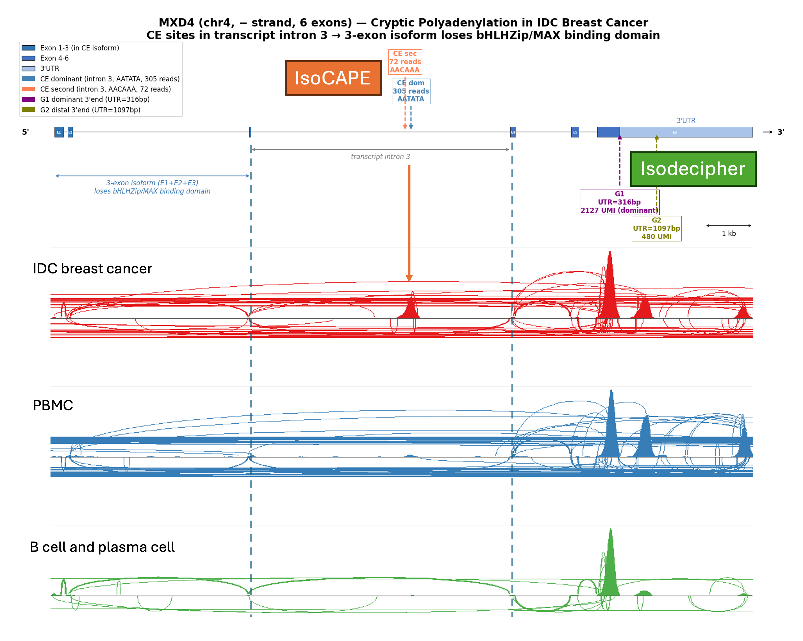
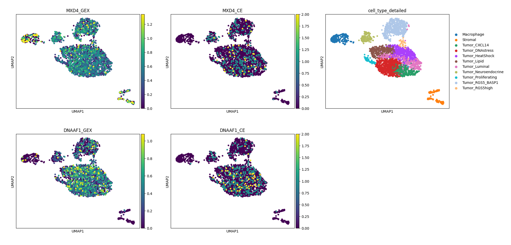
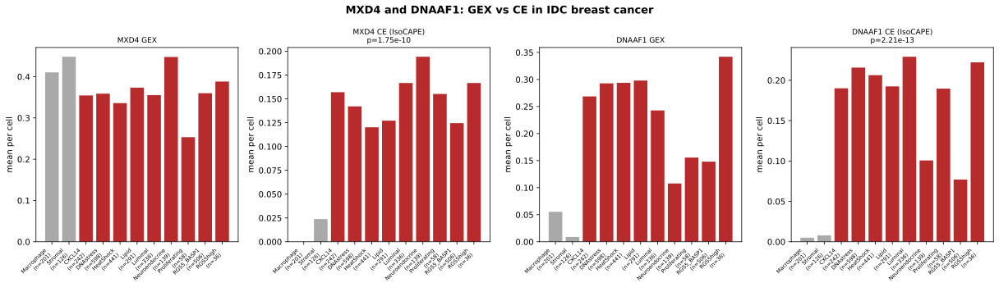

# IsoCAPE

**IsoCAPE** is a cryptic and premature polyadenylation scanner for RNA-seq data.

It detects polyadenylation sites that are **absent from GTF annotation** — intronic termination events, cryptic terminal exons, Alu-driven cryptic exons, and novel 3' end extensions — from standard RNA-seq BAM files, with no specialized assay or library preparation required.

[](LICENSE)
[]()
[]()

---

## Concept

Standard RNA-seq pipelines assign reads to annotated gene boundaries. Polyadenylation events that occur inside introns — driven by cryptic terminal exons — are collapsed into total gene counts or discarded entirely. These events are not noise: they are the molecular mechanism behind some of the most clinically consequential isoforms in cancer.

IsoCAPE reinterprets the genomic termination positions of 3' RNA-seq reads to detect where transcripts end — including positions the annotation does not know about.

```
RNA-seq reads → Cell Ranger / STAR → gene counts (cryptic site lost)

Cell        AR
--------------------
cell_1      45
cell_2      62
cell_3      38
```

IsoCAPE detects reads terminating inside AR intron 3, verifies the upstream PAS signal, and reports the cryptic site:

```
Cell      AR_CE3 (AR-V7, cryptic intron 3 site)
------------------------------------------------
cell_1          1
cell_2         44
cell_3          1
```

cell_2 is expressing AR-V7 at high level. This is invisible to standard pipelines. IsoCAPE and IsoDecipher outputs are stored as separate `obsm` layers in the GEX AnnData object — see [Integration with IsoDecipher](#integration-with-isodecipher) for the complete integration pattern.

---

## The AR-V7 case

AR-V7 is the leading resistance mechanism to enzalutamide and abiraterone in castration-resistant prostate cancer (CRPC). Its molecular origin is premature polyadenylation driven by a cryptic terminal exon (CE3) in AR intron 3. CE3 carries its own polyadenylation signal (PAS), causing transcription to terminate mid-gene and produce a truncated, constitutively active AR variant that is insensitive to androgen receptor antagonists.

Current clinical detection of AR-V7 requires specialized liquid biopsy assays from CTCs, plasma, or urine — a separate test, a separate sample, a separate cost.

IsoCAPE detects the same signal from BAM files already sequenced. Every archived prostate cancer RNA-seq dataset is a retrospectively scannable source of AR-V7 status, at single-cell resolution.

```
AR intron 3
─────────────────────────────────────────────────
Exon 3          CE3 (cryptic)          Exon 4
────┤           ┌──────────────┐       ├────────
    │     ~~~~~~│ PAS: AATAAA  │~~~~~  │
    │           │ poly-A tail  │       │
    │           └──────────────┘       │
    │                ↑                 │
    │         3' reads terminate here  │
    │         → AR_CE3 pileup          │
    │         → AR-V7 isoform          │
─────────────────────────────────────────────────
```

CE3 is not in the standard GTF. Cell Ranger assigns these reads to AR total counts. IsoCAPE detects the intronic pileup, confirms the AATAAA signal upstream, and labels the site `AR_CE3`.

---

## Why IsoCAPE?

| Feature | scTail | CRYPTID-exon | Sierra | IsoCAPE |
|---------|--------|--------------|--------|---------|
| Works on standard reads 2 | ❌ | ✅ | ✅ | ✅ |
| Reads 1 required | ✅ (required) | ❌ | ❌ | ❌ |
| Single-cell resolution | ✅ | ❌ | ✅ | ✅ |
| Bulk RNA-seq | ❌ | ✅ | ✅ | ✅ |
| Internal priming exclusion | ✅ | N/A | ❌ | ✅ |
| Intronic / cryptic site detection | partial | ✅ | ❌ | ✅ |
| PAS signal verification (AATAAA + variants) | ❌ | ❌ | ❌ | ✅ |
| Alu-driven CE detection (no PAS) | ❌ | ❌ | ❌ | ✅ |
| GTF-exclusion naming | ❌ | ❌ | ❌ | ✅ |
| Clinical label layer | ❌ | ❌ | ❌ | ✅ |
| Scanpy-ready output | ✅ | ❌ | ❌ | ✅ |
| Works on archived BAMs | ❌ | ✅ | ✅ | ✅ |

**Why reads 1 independence matters:** The majority of public 10x Genomics datasets have reads 1 trimmed or not sequenced. scTail, the only existing single-cell PAS detection tool, requires preserved reads 1 and cannot be applied to most archived datasets. IsoCAPE operates entirely on reads 2 — the same reads used by Cell Ranger — making it compatible with every standard 3' scRNA-seq dataset ever deposited.

**Why IsoCAPE's approach matters:** De novo tools like Sierra call any read pileup as a peak — producing coordinate-only names like `chr7:140833972` with no gene context and high noise. IsoCAPE uses the GTF as an exclusion reference to define what is already known (handled by IsoDecipher), then applies multi-layer filtering — internal priming exclusion, PAS signal verification, and Alu boundary validation — to confirm only biologically meaningful unannotated sites. Every IsoCAPE site carries a gene name, a type (CE, AluCE, or PA), and a verified signal, making them immediately interpretable as clinical features or ML inputs without post-processing.

**Why the label layer matters:** Unknown sites are not useless. They are ML features with full rights, retrospectively labelable as biology catches up, and candidates for novel discovery. The label layer is a living CSV — `cape_labels.csv` — that maps site IDs to known clinical relevance. It ships with curated entries for AR-V7 and grows as the community contributes.

---
### Figures

**Figure 1. MXD4 gene structure and IGV validation**



*Top: MXD4 gene structure (chr4, − strand, 6 exons). CE sites lie in transcript intron 3; the 3-exon truncated isoform loses the bHLHZip/MAX binding domain. IsoDecipher G1 (UTR=316bp, dominant) and G2 (UTR=1097bp) mark the annotated 3' ends. Bottom: IGV coverage tracks at the CE region. IDC breast cancer (red) shows a prominent pileup at both CE sites. PBMC (blue) and B cell/plasma cell (green) tracks show absent signal at the CE position despite MXD4 being expressed in these cell types — confirming tumor-specific intronic polyadenylation.*

---

**Figure 2. Single-cell UMAP: GEX vs CE signal**



*MXD4 (top row): GEX is broadly distributed across all cell types, whereas CE signal is enriched in tumor cells and near-absent in macrophages and stromal cells — demonstrating that CE is a tumor-specific event independent of expression level. DNAAF1 (bottom row): GEX is aberrantly activated in tumor cells (absent in immune/stromal populations); CE signal mirrors this tumor-restricted pattern, concentrated in the same cells that aberrantly express the gene.*

---

**Figure 3. Pseudo-bulk CE signal by cell type**



*Mean CE reads per cell across all annotated cell types (gray: non-tumor; red: tumor subtypes). MXD4 GEX is similar across cell types, yet MXD4 CE is 5–8× higher in tumor cells than in macrophages or stromal cells (Mann-Whitney U, p=1.75×10⁻¹⁰) — dissociating CE from expression level and implicating a tumor-specific splicing/polyadenylation mechanism. DNAAF1 CE is near-zero in all non-tumor cells and consistently elevated across every tumor subtype (p=2.21×10⁻¹³), consistent with the absence of DNAAF1 expression in immune and stromal populations.*

---

### Summary

| Gene | CE position | Intron | Non-tumor CE | Tumor CE | p-value |
|------|-------------|--------|-------------|----------|---------|
| MXD4 | chr4:2,254,615 (dominant) | transcript intron 3 | 0.009 | 0.141 | 1.75×10⁻¹⁰ |
| DNAAF1 | chr16:84,173,338 (dominant) | transcript intron 9 | 0.006 | 0.178 | 2.21×10⁻¹³ |

*CE signal = mean CE reads per cell. p-value: Mann-Whitney U, tumor vs non-tumor cells.*

Both events share a common theme: intronic polyadenylation as a mechanism to inactivate or truncate genes with potential tumor-suppressive or differentiation-associated functions, without requiring genetic mutation. MXD4 CE directly derepresses MYC — one of the most frequently activated oncogenes in breast cancer. DNAAF1 CE occurs on a background of aberrant gene activation, suggesting that the tumor transcriptional program both misexpresses and simultaneously truncates this gene. These findings illustrate the potential of IsoCAPE to detect functionally relevant isoform events from standard archived RNA-seq data, and motivate validation in larger cohorts and matched normal tissue.

---

- **Mouse / multi-species support** — mm10 GTF + reference genome
- **Spatial transcriptomics** — Visium BAM compatibility (spot-level APA resolution across tissue sections)
- **IsoCAPE-DB** — a community database of validated cryptic polyadenylation sites with clinical annotations across cancer types
- **IsoFormer integration** — IsoCAPE sites form the novel-site vocabulary for BAM-level foundation model training

---

## How It Works

```
RNA-seq BAM (bulk / scRNA-seq / spatial)
              │
              ▼
       bam_to_parquet.py
       ├── CB + UB tag filter (single-cell)
       ├── Valid barcode filter (auto-detects TSV/CSV/gz format)
       ├── UMI deduplication
       ├── Phred QC on 3' window
       └── Internal priming exclusion
           (A-tract scan ≥8 consecutive A's in downstream 20bp;
            reads failing this check are labelled INTERNAL_PRIME
            and excluded from downstream steps)
              │
              ▼  reads.parquet  [priming_label = VALID_PAS | INTERNAL_PRIME | NO_REF]
              │
              ▼
       site_annotator.py
       ├── UNK_GENE handling:
       │   → Standard reads: skip if no gene context (GN tag)
       │   → Special case: UNK_GENE reads at confirmed Alu boundaries
       │     are allowed through for AluCE detection (deep intronic
       │     reads often lack GN tag assignment from Cell Ranger)
       ├── Known 3' end check: ±50bp window against protein_coding
       │   transcript 3' ends (tx_biotype = protein_coding only;
       │   retained_intron / NMD transcript ends excluded)
       │   → match: labelled `known`; always output as reference signal
       ├── PAS signal check: scan 60bp upstream of ref_end
       │   PAS must be ≥10bp from ref_end (PAS_MIN_DIST)
       ├── CE classification (three independent filters required):
       │   1. query_intron(): read falls in protein_coding intron
       │   2. query_exon():   NOT in any exon of protein_coding /
       │                      NMD / non_stop_decay transcript
       │   3. GN tag == intron gene (neighboring-gene noise filter)
       │   → all three pass + PAS found: labelled `CE`  (GENE_CE_{coord})
       ├── AluCE classification (no PAS required):
       │   Same intron/exon/GN filters as CE, but instead of PAS:
       │   4. Alu boundary check (RepeatMasker BED, --alu-bed):
       │      upstream window overlaps Alu element AND
       │      ref_end itself is NOT inside any Alu element
       │      → genuine Alu/unique boundary, not Alu body internal priming
       │   Antisense Alu: for reads mapping antisense to a +strand gene
       │      (flag=16), both read strand and complement are queried
       │   → passes: labelled `AluCE`  (GENE_AluCE_{coord})
       └── PA classification (remaining genic + PAS reads):
           → labelled `PA`  (GENE_PA_{coord})
              │
              ▼  cryptic.parquet
              │
              ▼
       build_matrix.py
       ├── Pass 1: cluster reads per (gene, chrom, strand, site_type)
       │   within ±10bp tolerance; CE / AluCE / PA / known never merge
       ├── Pass 2: filter clusters
       │   CE / PA / known: < min_reads (default 3)
       │   AluCE:           < min_reads_alu (default 5, stricter)
       ├── Coord-based stable naming:
       │   CE    → GENE_CE_{rep_coord}
       │   AluCE → GENE_AluCE_{rep_coord}
       │   PA    → GENE_PA_{rep_coord}
       ├── PolyASite 2.0 validation (--polyadb):
       │   PA within ±50bp of known polyA site → PA_validated
       │   PA with no database match           → PA_novel
       └── AnnData (.h5ad): cells × sites
              │
              ▼
       IsoPrime (optional scoring)
       ├── Per CE site: compute P(genuine CE) using genomic context + PAS
       ├── Score tiers:
       │   P > 0.7:      high confidence canonical CE
       │   P 0.3–0.7:    moderate confidence (IGV validation recommended)
       │   P < 0.3:      low confidence (possible Alu-driven or retained intron)
       └── Adds isoprime_score to adata.var (does not hard-filter)
              │
              ▼
       Downstream (scanpy)
       ├── sc.pp.filter_genes(adata, min_cells=3)
       ├── CE fraction: CE / (CE + PA + known)  per gene
       ├── AluCE tumor-specificity: AluCE reads in tumor vs non-tumor cells
       ├── Label lookup (cape_labels.csv)
       └── Integration with IsoDecipher output (obsm layers)
```

---

## Site Types

| Site type | Mechanism | PAS required | Alu boundary | Naming |
|-----------|-----------|-------------|--------------|--------|
| `CE` | Canonical cryptic exon | ✅ | — | `GENE_CE_{coord}` |
| `AluCE` | Alu-driven cryptic exon | ❌ | ✅ | `GENE_AluCE_{coord}` |
| `PA` | Alternative polyadenylation | ✅ | — | `GENE_PA_{coord}` |
| `known` | Annotated 3' end (reference) | — | — | `GENE_known_{coord}` |

### AluCE: Alu-driven cryptic polyadenylation

Alu elements (SINEs, ~300bp, ~1.28M copies in hg38) contain internal A-rich regions that can serve as oligo-dT priming sites. In cancer cells with splicing dysregulation, premature transcriptional termination can occur at Alu element boundaries, producing truncated transcripts without canonical PAS signals.

IsoCAPE detects AluCE events by:
1. Confirming the read terminates at an Alu/unique sequence boundary (not inside Alu body)
2. Verifying via RepeatMasker annotation (`--alu-bed`) that upstream sequence overlaps a known Alu element
3. Confirming the read itself is not inside any Alu element (which would indicate internal priming, not genuine CE)

**Antisense Alu:** When a +strand gene contains an antisense Alu insertion, oligo-dT captures the Alu's A-rich tail on the antisense strand. These reads map to the minus strand (flag=16) even though the host gene is plus strand. IsoCAPE handles this by querying both the read strand and its complement for intron membership.

**Validated example — MGA intron 17 in IDC breast cancer:**
```
chr15:41,750,615────────────────────────────41,754,437
         Intron 17 (3,822 bp)

         chr15:41,752,575─────────────41,752,858
                     AluSx (antisense)
                                           ↑
                              AluCE peak: 41,752,859
                              140x tumor enrichment
                              No PAS (Alu-driven)
                              reads: -strand (flag=16)
```
MGA encodes a MYC antagonist (T-box + bHLHZ). AluCE in intron 17 truncates the bHLHZ domain, releasing MYC from suppression. This is analogous to the MGA intron 9 IPA event reported in CLL (Lee et al. 2018, Nature Genetics), but occurring at a different intronic Alu in breast cancer — demonstrating tissue-specific Alu exploitation of the same tumor suppressor.

---

## IsoPrime: Internal Priming Probability Scoring

IsoPrime is a companion scoring model that assigns a probability to each canonical CE site:

```
P(genuine CE) ∈ [0, 1]
```

**Score interpretation:**

| Score | Interpretation | Action |
|-------|---------------|--------|
| > 0.7 | High confidence canonical CE | Strong PAS, non-A-rich context |
| 0.3–0.7 | Moderate confidence | IGV validation recommended |
| < 0.3 | Low confidence | Possible Alu-driven or retained intron artifact |

IsoPrime v1 uses 17 features:
- Downstream genomic A-richness (A% at multiple windows, kmer patterns)
- Upstream PAS signal strength, distance, and sequence context
- Upstream sliding window A% (proxy for PAS region quality)

**Important:** IsoPrime scores canonical CE sites only. AluCE sites have no PAS and will receive low scores by design — this is expected and does not indicate false positives. AluCE validation uses orthogonal criteria (Alu boundary confirmation + tumor-specificity).

**Usage:**
```python
# After running build_matrix.py, annotate CE sites with IsoPrime scores
# isoprime_annotate.py adds adata.var['isoprime_score']

# High-confidence CE sites only
high_conf_ce = adata[:, (adata.var['site_type'] == 'CE') &
                        (adata.var['isoprime_score'] > 0.7)]

# All CE sites with score as metadata
ce = adata[:, adata.var['site_type'] == 'CE']
# ce.var['isoprime_score'] available for user-defined thresholds
```

IsoPrime scores are not hard filters. Users are encouraged to evaluate sites across the full score range and use IGV validation and tumor-specificity metrics for final prioritization.

---

**GTF biotype handling:**

| Index | Biotypes included | Purpose |
|-------|------------------|---------|
| `intron_trees` | `protein_coding` only | CE/AluCE positive signal — intron must belong to protein-coding transcript |
| `exon_trees` | `protein_coding`, `protein_coding_CDS_not_defined`, `protein_coding_LoF`, `nonsense_mediated_decay`, `non_stop_decay` | CE/AluCE negative filter — excludes positions exonic in any of these transcripts |
| `known_3p_ends` | `protein_coding` **transcript** (`tx_biotype`) | Known 3' end reference — retained_intron / NMD transcript ends excluded |

**Known sites:**

Known 3' ends are output alongside CE and PA sites to serve as expression-level reference signal. The known site count per cell tracks total transcript output from the gene's annotated 3' end — enabling CE fraction normalization:

```python
CE_fraction = CE_UMIs / (CE_UMIs + PA_UMIs + known_UMIs)
```

This normalization makes CE detection robust to differences in overall gene expression between cell types.

**Coordinate-based naming:**

Site names embed the representative cleavage coordinate for cross-run stability. Coordinate-based naming ensures the same site receives the same ID across samples and pipeline versions.

---

## Label layer

`cape_labels.csv` ships with curated entries for known clinically relevant cryptic sites:

```
site_id,    gene,  isoform,  label,                                    clinical_relevance
AR_CE3,     AR,    AR-V7,    Cryptic exon 3 premature polyadenylation,  Enzalutamide / abiraterone resistance in CRPC
AR_CE1,     AR,    AR-V1,    Cryptic exon 1,                            Androgen deprivation resistance; significance unclear
AR_CE2,     AR,    AR-V9,    Cryptic exon 2,                            Co-occurs with AR-V7; synergistic resistance
```

Unknown sites receive `label = unknown` and `clinical_relevance = —`. They are retained as first-class features in the count matrix.

The label file is a plain CSV — contributions welcome via pull request.

---

## Integration with IsoDecipher

IsoCAPE and IsoDecipher have a clean division of labour:

- **IsoDecipher** quantifies APA at annotated 3' ends — GTF-anchored, high-fidelity G-groups
- **IsoCAPE** detects APA at unannotated positions — CE, AluCE, and PA sites the GTF misses, plus `known` sites as reference signal

The recommended integration stores both modalities as `obsm` layers in the GEX AnnData object, avoiding axis-1 concatenation:

```python
import scanpy as sc
import scipy.sparse as sp
import numpy as np

# Load
adata_gex = sc.read_h5ad("gex_annotated.h5ad")   # GEX (preprocessed)
cape       = sc.read_h5ad("isocape_output.h5ad")   # IsoCAPE
apa        = sc.read_h5ad("isodecipher_output.h5ad") # IsoDecipher

# Align barcodes (IsoCAPE/IsoDecipher use SAMPLE_BARCODE format)
adata_gex.obs_names = ['SAMPLE_' + bc for bc in adata_gex.obs_names]

common_cape = adata_gex.obs_names.intersection(cape.obs_names)
common_apa  = adata_gex.obs_names.intersection(apa.obs_names)

# IsoCAPE layer (all sites)
cell_to_idx = {c: i for i, c in enumerate(adata_gex.obs_names)}
cape_mat = sp.lil_matrix((adata_gex.n_obs, cape.n_vars), dtype='float32')
for cell in common_cape:
    cape_mat[cell_to_idx[cell]] = cape[cell].X
adata_gex.obsm['isocape']         = sp.csr_matrix(cape_mat)
adata_gex.uns['isocape_features'] = cape.var_names.tolist()
adata_gex.uns['isocape_var']      = cape.var.to_dict()

# AluCE layer (separate for convenience)
alu_mask = cape.var['site_type'] == 'AluCE'
alu_mat  = sp.lil_matrix((adata_gex.n_obs, alu_mask.sum()), dtype='float32')
for cell in common_cape:
    alu_mat[cell_to_idx[cell]] = cape[cell, alu_mask].X
adata_gex.obsm['isocape_alu']         = sp.csr_matrix(alu_mat)
adata_gex.uns['isocape_alu_features'] = cape.var_names[alu_mask].tolist()

# IsoDecipher layer
iso_feats = apa.var_names[apa.var['feature_types'] == 'Isoform']
iso_mat = sp.lil_matrix((adata_gex.n_obs, len(iso_feats)), dtype='float32')
for cell in common_apa:
    iso_mat[cell_to_idx[cell]] = apa[cell, iso_feats].X
adata_gex.obsm['isoform']         = sp.csr_matrix(iso_mat)
adata_gex.uns['isoform_features'] = iso_feats.tolist()
```

IsoCAPE CE, AluCE, and PA sites are also candidate vocabulary entries for **IsoFormer** — the foundation model learns from both annotated and cryptic termination events across normal differentiation and malignancy.

---

## Caveats

### CE sites are more reliable than PA sites

CE sites pass **three independent filters** before PAS verification:

1. Must fall inside a `protein_coding` intron (`intron_trees`)
2. Must NOT overlap any exon of protein-coding, NMD, or non_stop_decay transcripts (`exon_trees`)
3. GN tag must match the intron's gene — neighboring-gene reads are excluded

PA sites require only: genic position + PAS signal + distance > 50bp from any known 3' end.

**Recommendation:** Use CE sites as the primary feature of interest. Apply stricter filtering for PA sites:

```python
# PA analysis: use only validated sites
pa_val = cape[:, cape.var['site_type'] == 'PA_validated']
sc.pp.filter_genes(pa_val, min_cells=10)  # stricter threshold
```

### Internal priming detection is incomplete

`bam_to_parquet` flags reads with ≥8 consecutive A's in the 20bp downstream genomic sequence as `INTERNAL_PRIME`. This catches obvious genomic polyA tracts but **does not capture**:

- Non-consecutive A-rich regions (e.g. `AATAAA…AAAAA` patterns)
- PAS signals that coincide with moderate A-rich context

IsoPrime v1 provides a continuous probability score (`isoprime_score`) for each CE site that captures these subtler internal priming patterns using 17 genomic context features. Sites with low IsoPrime scores (< 0.3) should be treated as low confidence and validated with IGV.

**IsoPrime score is not applicable to AluCE sites** — AluCE lacks PAS by definition and will receive low scores. AluCE confidence is assessed via orthogonal criteria (see below).

### AluCE requires additional validation

AluCE sites represent a distinct biological category that is **not fully resolvable** by IsoCAPE alone. Two interpretations exist for any tumor-specific AluCE:

**Interpretation A — Genuine Alu-driven CE:**
Cancer splicing dysregulation causes premature transcriptional termination at Alu element boundaries. A genuine polyA tail is added at the Alu/unique junction, producing a truncated transcript. This is a real biological event with potential functional consequence (e.g. domain truncation of a tumor suppressor).

**Interpretation B — Internal priming from retained intron:**
Cancer cells have more unspliced/intron-retained pre-mRNA due to splicing factor dysregulation. Alu elements in retained introns contain A-rich sequences (poly-A tail, A-rich linker) that oligo-dT can misprime on. The resulting reads are technical artifacts, but the underlying intron retention is still biologically meaningful.

In both cases, the event is tumor-specific and reflects splicing dysregulation. The distinction matters for downstream interpretation (truncated protein vs retained intron), but **not** for cancer-specificity assessment.

**Validation criteria for high-confidence AluCE:**

| Criterion | Strong evidence | Weak evidence |
|-----------|----------------|---------------|
| Alu boundary | ref_end at Alu/unique junction (rmsk) | Reads inside Alu body |
| Read clustering | Multiple reads at same position | Singletons |
| Tumor-specificity | > 5x enrichment vs non-tumor | < 2x enrichment |
| Strand | Antisense Alu (reads opposite to gene) | Sense Alu |
| Long-read | Truncated transcript confirmed | Not validated |

**Future validation:** Long-read sequencing (PacBio MAS-seq, ONT) is the gold standard for distinguishing genuine AluCE from internal priming. RT-PCR with junction-spanning primers can also confirm truncated transcript structure.

### Non-tumor reference is required for cancer-specificity assessment

IsoCAPE detects **CE usage**, not cancer-specific CE upregulation. Many CE sites are constitutive (present in all cell types) or reflect cell-type-specific APA rather than cancer biology. To identify cancer-specific events:

1. Compare CE fraction (CE / CE+PA+known) between tumor and non-tumor cells in the same dataset
2. Validate with IGV: cancer-specific sites should show a pileup in tumor BAM but not in matched normal or PBMC BAM
3. Use non-tumor cells within the dataset (macrophages, stromal cells) as an internal reference

Sites confirmed by both approaches (statistical enrichment + IGV) are high-confidence cancer-specific CE events.

### 3' scRNA-seq limitations

IsoCAPE is optimized for 10x Genomics 3' scRNA-seq (Chromium v2/v3). Limitations:

- **Sparse per-cell signal:** most genes have 1–5 UMI per cell; per-cell CE fraction is unreliable. Use pseudo-bulk (sum across cell type) for quantification.
- **3' bias:** only the terminal ~500bp of each transcript is captured; IsoCAPE cannot distinguish CE events near the annotated 3' end from normal APA.
- **Validation recommended:** bulk 3'-seq (QuantSeq, PAPERCLIP), long-read sequencing 
(PacBio MAS-seq / ONT direct RNA-seq), or 
RT-PCR with isoform-specific junction-spanning primers
---

## Repository Structure

```
IsoCAPE/
├── IsoCAPE/
│   └── scripts/
│       ├── bam_to_parquet.py           # Step 1: BAM → reads parquet
│       ├── bam_to_parquet_parallel.py  # Step 1: parallel multi-core version
│       ├── build_matrix.py             # Step 3: parquet → AnnData (.h5ad)
│       ├── isoprime_v1.py              # IsoPrime: CE confidence scoring
│       └── annotator/
│           ├── gtf_parser.py           # GTF/DB index builder
│           └── site_annotator.py       # Step 2: CE / AluCE / PA / known annotation
│               # PAS_WINDOW=60bp, PAS_MIN_DIST=10bp
│               # known-window=50bp
│               # GN tag consistency filter
│               # Alu boundary check (--alu-bed)
│               # Antisense Alu handling (flag=16)
├── notebooks/
│   └── 01_AR-V7_demo.ipynb            # Validation: AR-V7 detection in CRPC
├── data/
│   └── cape_labels.csv                # Curated clinical label layer
├── results/
│   └── figures/
├── requirements.txt
└── README.md
```

---

## Future direction

- **IsoPrime optimization** — expand training data with more validated CE sites across cancer types; per-sample calibration using major 3'UTR peak as positive control
- **AluCE reference database** — curated validated Alu-driven CE events with tumor-type annotations; enables rapid cross-dataset comparison
- **Long-read validation pipeline** — automated comparison of IsoCAPE CE/AluCE calls against PacBio/ONT data for structural confirmation
- **Mouse / multi-species support** — mm10 GTF + reference genome
- **Spatial transcriptomics** — Visium BAM compatibility (spot-level APA resolution across tissue sections)
- **IsoCAPE-DB** — a community database of validated cryptic polyadenylation sites with clinical annotations across cancer types
- **IsoFormer integration** — IsoCAPE CE and AluCE sites form the novel-site vocabulary for BAM-level foundation model training

---

## License

MIT License  
© 2026 Rene Yu-Hong Cheng
